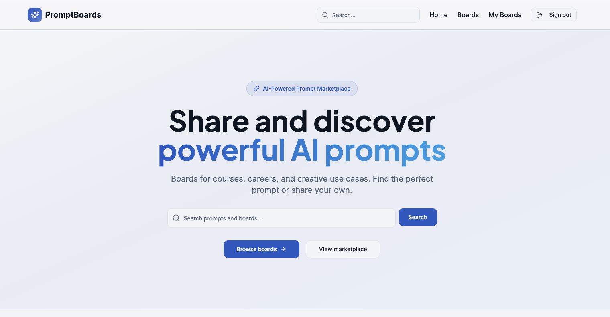
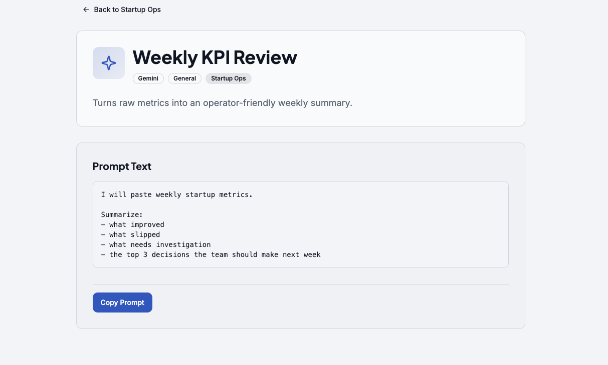
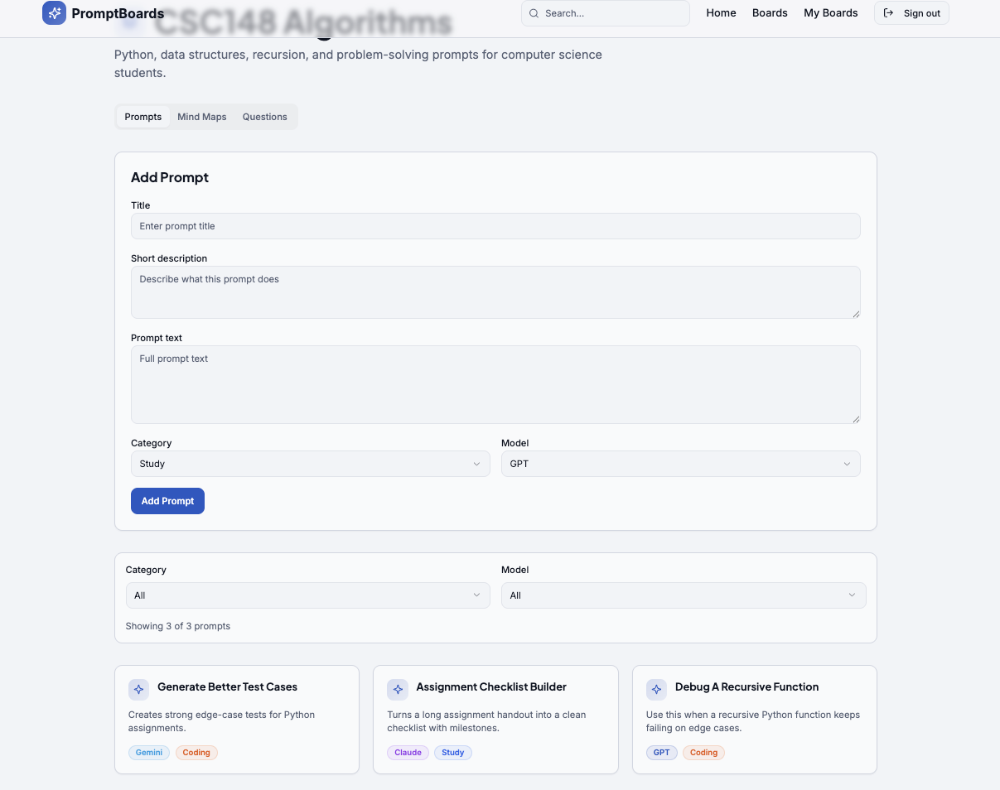
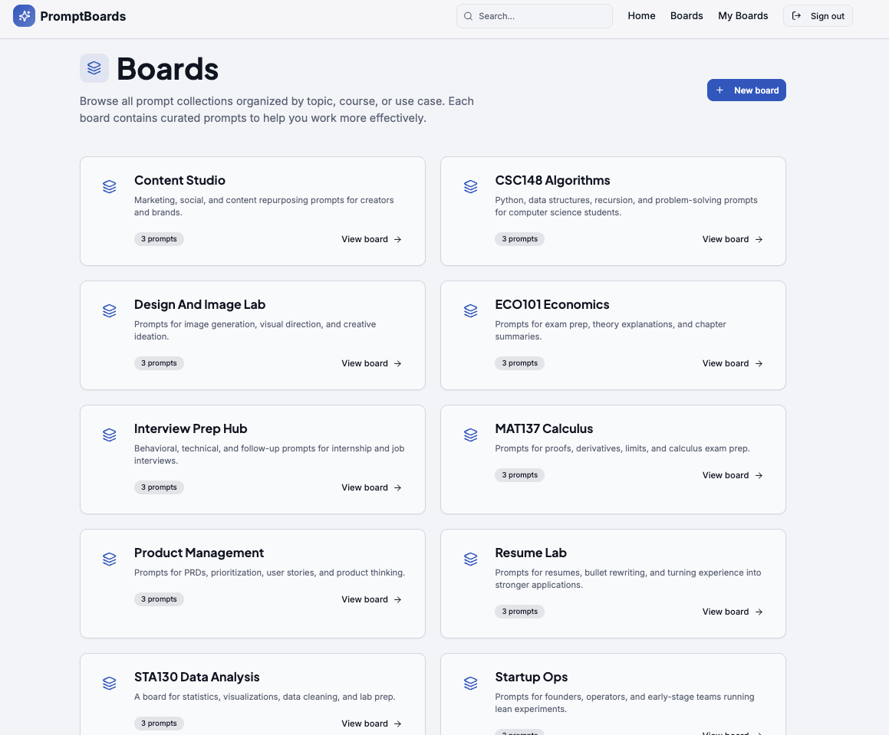

# PromptBoards

PromptBoards is my first full-stack project that I learned how to deploy end to end. It was the first time I took a project from local development to a live frontend on Vercel and a live backend on Render, and it taught me a lot about connecting a real React frontend to a Django API, handling auth, configuring environment variables, and making sure the whole app works across deployment.

## What This Project Is

PromptBoards is a prompt-sharing marketplace-style platform built around the idea that prompts should be easier to organize, discover, and reuse.

Instead of keeping useful prompts scattered across notes or chat history, users can put them into boards based on different use cases. A board can represent a topic, workflow, class, career path, or any other category. Inside those boards, users can upload prompts, browse prompts from other people, and copy prompts into their own AI workflows.

The goal of the project is to make prompts feel more reusable and community-driven. It is not a payment marketplace right now. It is a place to share, explore, and use prompts more effectively.

## How The App Works

The current product flow looks like this:

1. A user lands on the homepage and can browse featured boards and recent prompts.
2. The user can search across boards and prompts by keyword.
3. A user can create an account or sign in.
4. Signed-in users can create their own boards.
5. Inside a board, users can browse prompts related to that board.
6. Prompts can be filtered by category and model.
7. Signed-in users can upload new prompts to a board.
8. A user can open an individual prompt page and copy the full prompt text for their own use case.

The overall experience is meant to feel like a prompt library plus a community board system, where prompts are grouped in a way that is easier to navigate than a long list.

## Current Tech Stack

### Frontend

- React
- TypeScript
- Vite
- React Router
- Tailwind CSS
- shadcn/ui
- Radix UI
- TanStack Query
- Vercel Analytics

### Backend

- Django
- Django REST Framework
- SimpleJWT
- django-cors-headers
- Gunicorn

### Data And Deployment

- PostgreSQL-backed Django configuration through environment variables
- Vercel for frontend deployment
- Render for backend deployment

## Architecture And Data Flow

The frontend talks to the backend through a Vite environment variable:

`VITE_API_BASE_URL`

That value is used in the frontend context layer to decide where API requests should go.

### Auth Flow

- `POST /api/auth/register/` creates a new user
- `POST /api/auth/login/` signs a user in
- On success, the frontend stores the access token, refresh token, and basic user data in `localStorage`

### Board And Prompt Flow

- `GET /api/boards/` fetches available boards
- `POST /api/boards/` creates a new board
- `GET /api/prompts/` fetches prompts
- `POST /api/prompts/` creates a new prompt

At a high level, the flow is:

1. React pages load and request board and prompt data from the Django API.
2. The backend returns structured board and prompt data from the database.
3. The frontend maps that response into UI-friendly data for cards, detail pages, and filters.
4. When a signed-in user creates a board or prompt, the frontend sends a `POST` request to Django and updates the visible state after the response comes back.

## What I Learned From Building It

This project was a big learning step for me because it was the first time I had to think beyond just building screens.

I learned how to:

- connect a React frontend to a Django REST backend
- handle authentication with JWT tokens
- manage API base URLs between local development and deployed environments
- configure CORS so the frontend and backend could talk to each other
- deploy a frontend on Vercel and a backend on Render
- think about how product flow, data flow, and deployment all connect together

## Local Frontend Setup

From the `frontend` directory:

```bash
npm install
```

Create a `.env` or `.env.local` file in `frontend` and set:

```env
VITE_API_BASE_URL=http://localhost:8000
```

If you want to point the frontend at the deployed backend instead, use your live Render backend URL instead of `http://localhost:8000`.

Start the frontend:

```bash
npm run dev
```

The Vite dev server is configured to run on:

`http://localhost:8080`

## Current Status

The core PromptBoards flow is working: users can sign up, sign in, browse boards, create boards, browse prompts, and upload prompts through the Django API.

A few features are still evolving:

- Google auth is present in the UI but not wired to the backend yet
- Mind maps and questions currently live in frontend state instead of the backend
- Some ownership and visibility behavior is still simplified in the current version

## Why PromptBoards Matters To Me

I built PromptBoards because I liked the idea of treating prompts as reusable assets instead of one-off chat messages. I wanted a place where people could organize prompts by real use cases like studying, coding, resumes, image generation, and general productivity.

More than anything, this project represents the point where I started learning how to ship full-stack work, not just build pieces of it locally.
---

## Screenshots

### Website home page


### Prompt Example can be more complicated


### Single Board


### Multiple Boards
